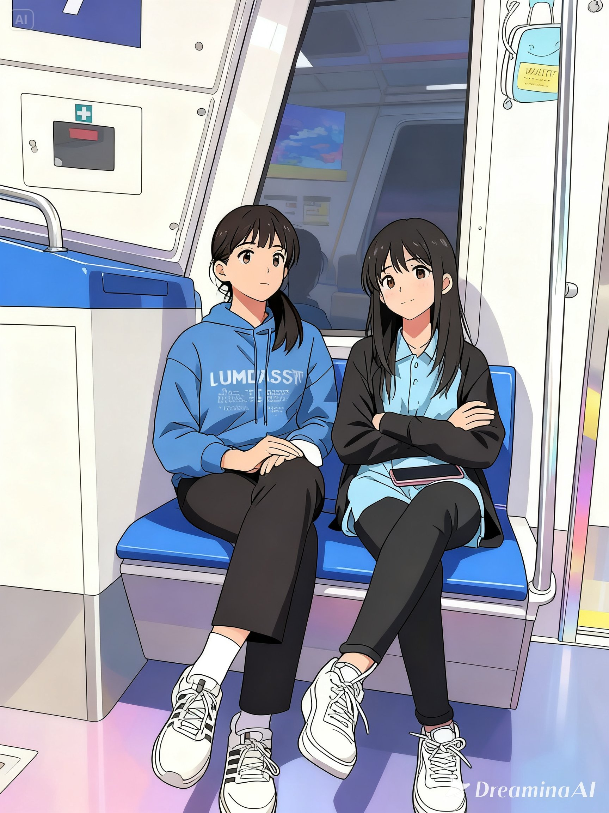

  

# Halo, Saya Frsihta Riris Annesa Tambunan! 👋

Saya adalah mmahasiswi Polibatam dari Teknik Informasi Prodi Teknologi Rekayasa Perangkat Lunak. Saat ini saya sedang belajar terkait implementasi Git ini ke dalam sebuah proyek yang sedang saya kerjakan bersama tim saya. Sebagai mahasiswi, saya sangat bersemangat dalam mempelajari hal-hal baru untuk dicoba. Karena tantangan itu seru banget lho!

---

### 👤 Identitas & Kontak
- 📍 **Alamat:** Tg. Buntung Blok Q1 No 17, Batam, Kepri, Indonesia
- 📧 **Email:**  frishtatamb.0686@gmail.com
- 💼 **LinkedIn:** https://www.linkedin.com/in/frishta-r-a-t-ab40173b3/
- 🐙 **GitHub:** https://github.com/nona-frishtaa

---

### 🎓 Riwayat Pendidikan
| Jenjang | Institusi | Jurusan | Tahun |
| :--- | :--- | :--- | :--- |
| **Perguruan Tinggi** | Polibatam  | TRPL | 2025-2026 |
| **SMU/SMK** | SMK EBEN HAEZER BATAM | RPL | 2022-2025 |

---

### 🚀 Riwayat Proyek
#### 📂 Proyek PBL (Project Based Learning) - Semester 2
- **Aplikasi Peminjaman SBUM**
  - *Deskripsi:* Aplikasi Peminjaman SBUM adalah sistem berbasis website yang digunakan  untuk mengelola proses peminjaman ruangan dan fasilitas di Politeknik Negeri Batam. Melalui sistem ini, peminjam dapat melakukan pengajuan secara online, admin mengelola data ruangan dan jadwal penggunaan, serta pihak berwenang memberikan persetujuan secara digital. Sistem ini juga mendukung pencatatan data peminjaman dan pembuatan laporan secara otomatis..
  - *Peran:* Business Analyst.
  - *Teknologi:* HTML, CSS, JavaScript, Python.

#### 📂 Proyek Lainnya
- **Membuat Github Profile**
  - *Deskripsi:* Membuat 'kartu nama' digital sebagai seorang developer. Tujuannya supaya tampilan github profile kita lebih rapi, terstruktur, dan profesional. 
  - *Tahun:* 2026.

---

### 🛠️ Skillset (Keahlian)

#### 💻 Programming Languages & Tools
- **Languages:**   
- **Frameworks/Tools:**   

#### 🤝 Soft Skills
- Komunikasi Efektif
- Kerja Sama Tim (Teamwork)
- Problem Solving
- Manajemen Waktu

---

### 📊 GitHub Stats

---
*Dibuat dengan ❤️ oleh Nona Frishta*